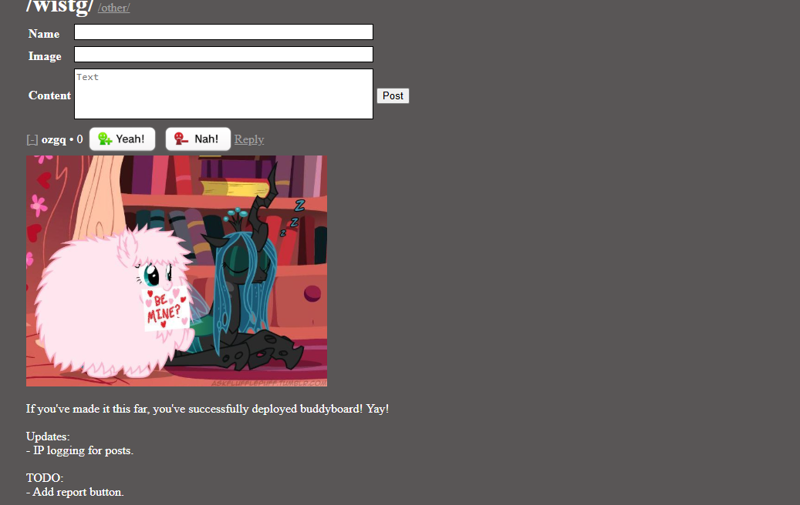

# buddyboard
Minimalist imageboard for friends written in Flask. Uses a flat-file (json) database, and strongly encourages hotlinking of images. 

# Features
**Strengths**
- Uses wesrv as an image proxy to filter bad actors
- Logs IPs to also filter bad actors and botnets
- Sanitizes user input using MarkupSafe
- User voting on posts

**Weaknesses**
- No admin panel/way to delete posts autonomously (yet)
- jQuery functions are partially wonky
- Written in Flask
- Does not bar VPNs/proxies/etc from interfacing with the website
- No user reporting function (yet)
- No separate file to specifically handle database management, making contribution (possibly) strenuous

# How to deploy
- `pip install -r requirements.txt`
- `py -u ./main.py` or deployable equivalent

# Credits
- Stack Overflow
- Early testers via ngrok